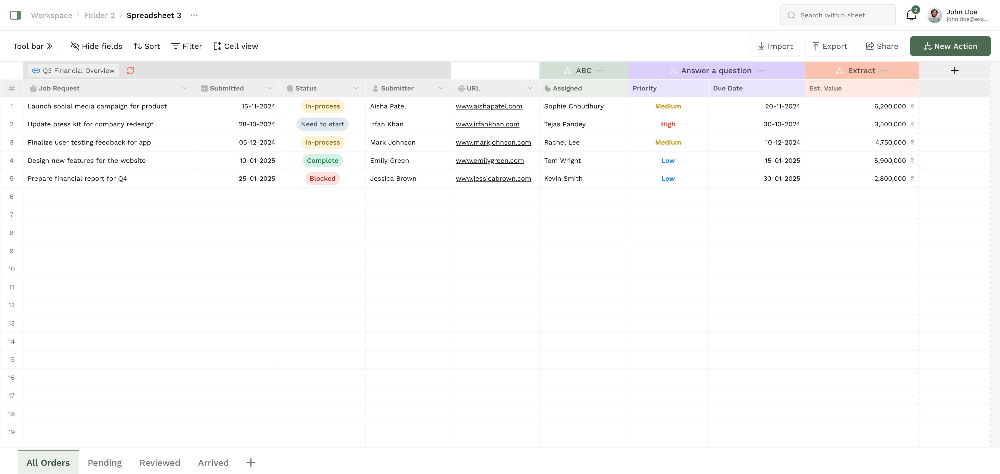
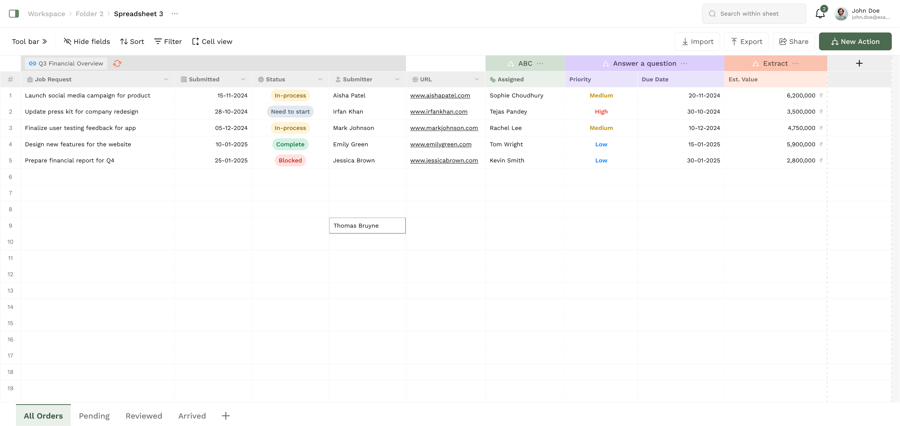
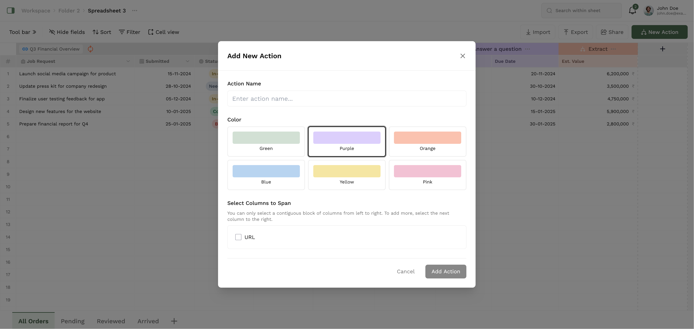
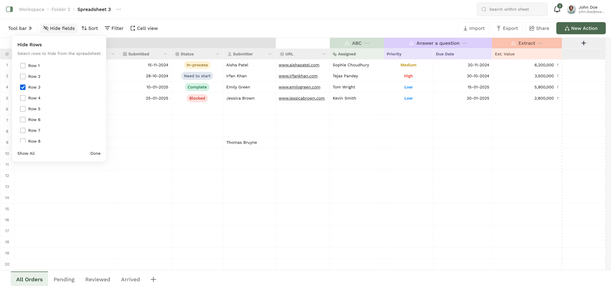

# InScripts Spreadsheet

A modern, feature-rich spreadsheet application built with React 18 and TypeScript.

## 📸 Screenshots

### Main Interface


_The main spreadsheet interface showing the table, toolbar, and navigation_

### Cell Editing


_Inline cell editing with keyboard navigation and validation_

### New Action Modal


_Creating custom action headers with color coding and column selection_

### Hide Fields Tool


_Row visibility management with persistent state_

---

## 🚀 Features

### Core Functionality

- **Interactive Spreadsheet Table**: Built with `@tanstack/react-table` for high-performance data handling
- **Cell Editing**: Inline cell editing with keyboard navigation (Enter to edit, Escape to cancel)
- **Dynamic Headers**: Add custom action headers that span multiple columns with color coding
- **Column Management**: Add, remove, and resize columns dynamically
- **Row Management**: Hide/show rows and manage large datasets efficiently

### Data Management

- **Import/Export**: Import from JSON templates or export current sheets to JSON
- **Local Storage**: Automatic data persistence using browser localStorage
- **Multiple Sheets**: Support for multiple spreadsheet sheets with easy switching
- **Template System**: Pre-built templates for different use cases (Financial Data, Pending Reviews, Completed Projects)

### UI/UX Features

- **Responsive Design**: Works on desktop and mobile devices
- **Modern UI**: Clean, professional interface with Tailwind CSS styling
- **Toolbar Actions**: Quick access to common functions (Hide fields, Sort, Filter, Cell view)
- **Modal System**: Intuitive modals for complex operations
- **Tooltips & Popovers**: Contextual help and information
- **Keyboard Navigation**: Full keyboard support for power users

### Advanced Features

- **Status Management**: Color-coded status indicators (In-process, Need to start, Complete, Blocked)
- **Priority System**: Visual priority indicators (High, Medium, Low)
- **URL Handling**: Clickable URLs with external link indicators
- **Value Formatting**: Automatic formatting for currency values (₹)
- **Row Selection**: Visual feedback for selected cells and rows

## 🛠️ Setup & Installation

### Prerequisites

- Node.js 16+
- npm or yarn

### Installation

```bash
# Clone the repository
git clone https://github.com/vermilion4/inscripts-spreadsheet.git
cd inscripts-spreadsheet

# Install dependencies
npm install

# Start development server
npm start
```

The application will be available at `http://localhost:3000`

### Available Scripts

```bash
npm start          # Start development server
npm run build      # Build for production
npm test           # Run tests
npm run lint       # Run ESLint
npm run lint:fix   # Fix ESLint issues
npm run format     # Format code with Prettier
npm run type-check # Run TypeScript type checking
```

## 🏗️ Architecture & Trade-offs

### Technology Choices

**React 18**:

- ✅ Modern features like concurrent rendering
- ✅ Stable ecosystem and extensive documentation
- ❌ Larger bundle size compared to alternatives

**@tanstack/react-table**:

- ✅ Excellent performance for large datasets
- ✅ Built-in sorting, filtering, and virtualization
- ✅ TypeScript support
- ❌ Learning curve for complex configurations

**TypeScript**:

- ✅ Type safety and better developer experience
- ✅ Better IDE support and refactoring
- ❌ Additional build complexity

**Tailwind CSS**:

- ✅ Rapid development with utility classes
- ✅ Consistent design system
- ❌ Larger CSS bundle in production

### Performance Considerations

**Pros**:

- Efficient re-rendering with React 18
- Optimized table rendering with @tanstack/react-table
- Local storage for data persistence

**Trade-offs**:

- Client-side only (no server-side rendering)
- Data stored in localStorage (limited by browser storage)
- No offline support beyond localStorage

## 📄 License

This project is licensed under the MIT License.
